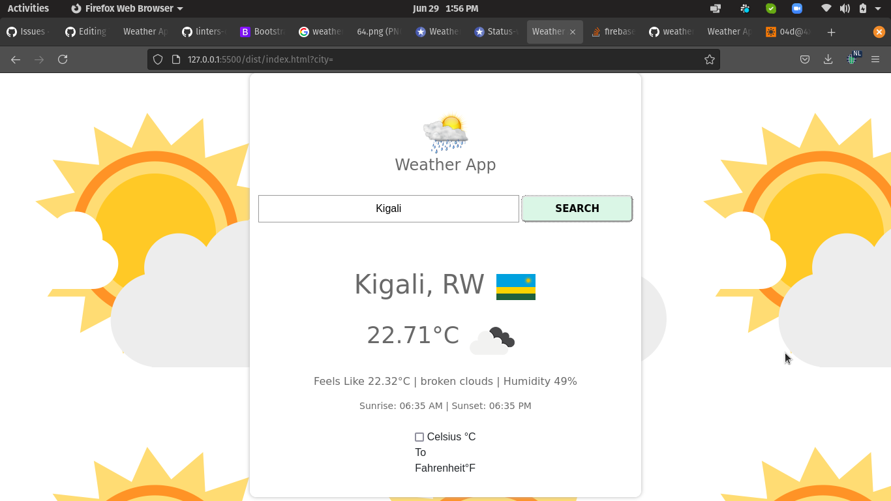

# The Weather App

> A weather app: is an app that pulls data from the OpenWeatherMap API to allow users to search for and view the forecast in cities worldwide. Built with JavaScript using webpack and async functions.

> A Weather App is part of Full-Stack JavaScript Curriculum in the [the Odin Project’s](https://www.theodinproject.com/paths/full-stack-javascript/courses/javascript/lessons/weather-app).

## Built With

- JavaScript (Async functions)
- Webpack
- API (OpenWeathermap)
- HTML5
- CSS3
- Bootstrap

## Live Demo

[Live Demo Link]()

## Getting Started

To get a local copy up and running follow these simple example steps.

### Setup
    Step 1: git clone https://github.com/Emmyn5600/WeatherApp.git
    
    Step 2: open live-server

## Author

👤 **NSABIMANA Emmanuel**

- GitHub: [@emmyn5600](https://github.com/Emmyn5600)
- Twitter: [@NSABIMA62253884](https://twitter.com/NSABIMA62253884)
- LinkedIn: [@nsabimana-emmanuel-4276091b2](https://www.linkedin.com/in/nsabimana-emmanuel-4276091b2/)

## 🤝 Contributing

Contributions, issues, and feature requests are welcome!

Feel free to check the [issues page](https://github.com/Emmyn5600/WeatherApp/issues).

## Show your support

Give a ⭐️ if you like this project!

## 📝 License

This project is [MIT](./MIT.md) licensed.
